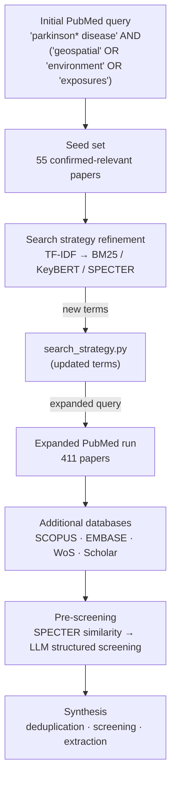

# Systematic Review: Geographic & Environmental Risk Factors in Parkinson's Disease

Automated pipeline for a systematic review of the 2020–2025 literature on geographic and environmental risk factors in Parkinson's disease — air pollutants, pesticides, heavy metals, trichloroethylene, and related exposures.

**STATUS**: In progress — PubMed collection complete (411 articles); seed set built; additional databases pipeline built and pending access runs.

---

## Pipeline Overview



---

## Roadmap

### Milestone 1: Initial Exploration & Seed Set ✅
- Ran a narrow exploratory PubMed query — `"parkinson* disease" AND ("geospatial" OR "environment" OR "exposures")` — to get an initial corpus
- Manually identified 55 confirmed-relevant papers → `seed_papers/`
- `build_seed_csv.py` extracts metadata from the PDFs (PyMuPDF + CrossRef) → `seed_papers.csv`

### Milestone 2: Search Strategy Refinement ⏳
- **Iterative term expansion & refinement workflow** (`query_refinement.ipynb`):
  - **Method 1: TF-IDF** — corpus-level term ranking + cosine similarity to seed query
  - **Method 2: BM25** — probabilistic term-frequency ranking with length normalisation
  - **Method 3: KeyBERT + YAKE** — keyphrase extraction to surface new vocabulary from seed abstracts
  - **Method 4: SPECTER** — semantic similarity embeddings to find papers using different terminology
  - All methods ranked papers against 55 confirmed-relevant seed papers to identify top-ranked *and* outlier papers
  
- **Outlier analysis** — papers furthest from seed set (low SPECTER similarity):
  - Extracted top terms from outlier papers using TF-IDF
  - Compared against existing INCLUSION_CRITERIA, ALTERNATE_TERMS, and EXCLUSION_TERMS
  - Identified new exclusion candidates (high-frequency terms in outliers NOT already in strategy)
  - **Exclusion criteria building**: Terms flagged as noise/irrelevant were added to `EXCLUSION_TERMS` in `search_strategy.py`
  
- **Output files**:
  - `query_refinement_ranked.csv` — papers ranked by combined BM25 + SPECTER score
  - `csv-parkinsonT-set_SPECTER.csv` — SPECTER-ranked papers for further review
  - `csv-parkinsonT-set_SPECTER_FULL.csv` — full paper metadata (title, abstract, authors, journal, DOI) fetched from PubMed for top-ranked papers
  
- New terms and refined exclusion criteria feed back into `search_strategy.py` before the full multi-database run

### Milestone 3: Expanded PubMed Collection ✅
- Expanded query (TF-IDF-informed terms) → 411 cleaned articles → `pubmed_results_cleaned_2026.csv`

### Milestone 4: Additional Databases ⏳
- **SCOPUS** — `scopus.ipynb` uses `elsapy`, year-by-year to stay within the free-tier 5,000-record cap; flip `SUBSCRIBER_ACCESS = True` once an InstToken is available
- **EMBASE** — `embase.ipynb` uses the Embase Search API (same Elsevier key); coordinate Emtree term mapping with Malcolm & Lukas
- **Web of Science** — `web_of_science.ipynb` via WoS Starter API; pending institutional `WOS_API_KEY`
- **Google Scholar** — `google_scholar.ipynb` via `scholarly`; supplementary only

### Milestone 5: Pre-screening ⬜
- SPECTER/BM25 similarity filter against seed embeddings → cheap first pass
- LLM structured screening on survivors via `prescreen.ipynb` (Ollama, local, no API key); PICO-style prompts at temperature=0 for reproducibility

### Milestone 6: Synthesis ⬜
- Cross-database deduplication
- Formal title/abstract → full-text → risk-of-bias screening
- Data extraction and synthesis

---

## Project Structure

```
search_strategy.py               — inclusion/exclusion criteria and DB configs (edit here only)
build_seed_csv.py                — extracts metadata from PDFs in seed_papers/ → seed_papers.csv
seed_papers/                     — downloaded PDFs of confirmed-relevant seed papers
seed_papers.csv                  — seed paper metadata (title, abstract, DOI, authors, …)
pubmed.ipynb                     — PubMed collection, cleaning, TF-IDF term analysis
query_refinement.ipynb           — BM25 / KeyBERT+YAKE / SPECTER ranking & outlier analysis for term refinement
  → query_refinement_ranked.csv  — papers ranked by combined BM25 + SPECTER similarity
  → csv-parkinsonT-set_SPECTER_FULL.csv — full papers (title, abstract, authors, journal) fetched from PubMed
scopus.ipynb                     — SCOPUS collection via elsapy
embase.ipynb                     — EMBASE collection via Embase Search API
web_of_science.ipynb             — Web of Science collection via WoS Starter API
google_scholar.ipynb             — Google Scholar scrape via scholarly (supplementary)
prescreen.ipynb                  — (planned) Ollama LLM pre-screening
pubmed_results_cleaned_2026.csv  — cleaned PubMed results (411 articles)
requirements.txt                 — Python dependencies
archive/                         — superseded notebooks
```

---

## How to Run

**Prerequisites:** Python 3, `.env` with `PUBMED_EMAIL`, `ELSEVIER_API_KEY`, `ELSEVIER_INSTTOKEN` (optional), `WOS_API_KEY` (once granted).

```bash
pip install -r requirements.txt
```

### Iterative Workflow:

1. **Build seed set** — `build_seed_csv.py` generates `seed_papers.csv` from PDFs in `seed_papers/`

2. **Refine search strategy** (`query_refinement.ipynb`):
   - Loads seed papers and the current search corpus
   - Ranks papers using four complementary methods (TF-IDF, BM25, KeyBERT+YAKE, SPECTER)
   - **Key analysis**: Identifies outlier papers (papers dissimilar to seed set)
     - Extracts top terms from outliers
     - Compares against existing INCLUSION_CRITERIA, ALTERNATE_TERMS, EXCLUSION_TERMS
     - Flags new candidate exclusion terms
   - **Review findings**: Decide which new terms to add to `search_strategy.py` based on outlier inspection
   - **Output**: `query_refinement_ranked.csv` for offline review; `csv-parkinsonT-set_SPECTER_FULL.csv` with full PubMed metadata

3. **Update search criteria** — edit `search_strategy.py` to:
   - Add new high-value terms to INCLUSION_CRITERIA or ALTERNATE_TERMS (from top-ranked papers)
   - Add noise terms to EXCLUSION_TERMS (from outlier analysis)

4. **Collect expanded results** (`pubmed.ipynb`) — re-run with updated query to collect full corpus

5. **Collect from additional databases** — `scopus.ipynb` / `embase.ipynb` / `web_of_science.ipynb` / `google_scholar.ipynb`
5. `prescreen.ipynb` — LLM pre-screening *(in development)*

To adjust the search: edit `search_strategy.py` and re-run the relevant notebooks.
