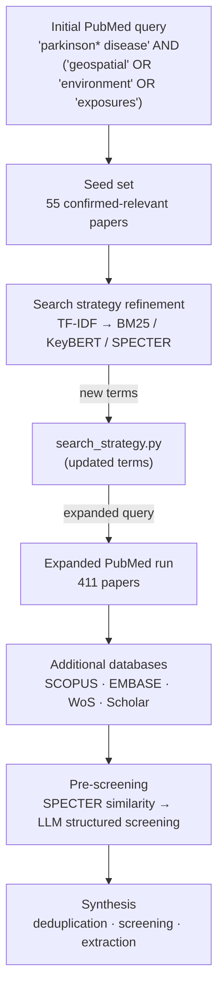

# Systematic Review: Geographic & Environmental Risk Factors in Parkinson's Disease

Automated pipeline for a systematic review of the 2020–2025 literature on geographic and environmental risk factors in Parkinson's disease — air pollutants, pesticides, heavy metals, trichloroethylene, and related exposures.

**STATUS**: In progress — PubMed collection complete (411 articles); seed set built; additional databases pipeline built and pending access runs.

---

## Pipeline Overview



---

## Roadmap

### Milestone 1: Initial Exploration & Seed Set ✅
- Ran a narrow exploratory PubMed query — `"parkinson* disease" AND ("geospatial" OR "environment" OR "exposures")` — to get an initial corpus
- Manually identified 55 confirmed-relevant papers → `seed_papers/`
- `build_seed_csv.py` extracts metadata from the PDFs (PyMuPDF + CrossRef) → `seed_papers.csv`

### Milestone 2: Search Strategy Refinement ⏳
- TF-IDF analysis on the initial corpus surfaced new terms → folded into `search_strategy.py`
- `query_refinement.ipynb` is testing three stronger methods against the seed set:
  - **BM25** — term-frequency ranking with length normalisation
  - **KeyBERT + YAKE** — keyphrase extraction to surface new vocabulary
  - **SPECTER** — semantic similarity to catch papers using different terminology for the same concepts
- Findings feed back into `search_strategy.py` before the full multi-database run

### Milestone 3: Expanded PubMed Collection ✅
- Expanded query (TF-IDF-informed terms) → 411 cleaned articles → `pubmed_results_cleaned_2026.csv`

### Milestone 4: Additional Databases ⏳
- **SCOPUS** — `scopus.ipynb` uses `elsapy`, year-by-year to stay within the free-tier 5,000-record cap; flip `SUBSCRIBER_ACCESS = True` once an InstToken is available
- **EMBASE** — `embase.ipynb` uses the Embase Search API (same Elsevier key); coordinate Emtree term mapping with Malcolm & Lukas
- **Web of Science** — `web_of_science.ipynb` via WoS Starter API; pending institutional `WOS_API_KEY`
- **Google Scholar** — `google_scholar.ipynb` via `scholarly`; supplementary only

### Milestone 5: Pre-screening ⬜
- SPECTER/BM25 similarity filter against seed embeddings → cheap first pass
- LLM structured screening on survivors via `prescreen.ipynb` (Ollama, local, no API key); PICO-style prompts at temperature=0 for reproducibility

### Milestone 6: Synthesis ⬜
- Cross-database deduplication
- Formal title/abstract → full-text → risk-of-bias screening
- Data extraction and synthesis

---

## Project Structure

```
search_strategy.py               — inclusion/exclusion criteria and DB configs (edit here only)
build_seed_csv.py                — extracts metadata from PDFs in seed_papers/ → seed_papers.csv
seed_papers/                     — downloaded PDFs of confirmed-relevant seed papers
seed_papers.csv                  — seed paper metadata (title, abstract, DOI, authors, …)
pubmed.ipynb                     — PubMed collection, cleaning, TF-IDF term analysis
query_refinement.ipynb           — BM25 / KeyBERT+YAKE / SPECTER ranking against seed set
scopus.ipynb                     — SCOPUS collection via elsapy
embase.ipynb                     — EMBASE collection via Embase Search API
web_of_science.ipynb             — Web of Science collection via WoS Starter API
google_scholar.ipynb             — Google Scholar scrape via scholarly (supplementary)
prescreen.ipynb                  — (planned) Ollama LLM pre-screening
pubmed_results_cleaned_2026.csv  — cleaned PubMed results (411 articles)
requirements.txt                 — Python dependencies
archive/                         — superseded notebooks
```

---

## How to Run

**Prerequisites:** Python 3, `.env` with `PUBMED_EMAIL`, `ELSEVIER_API_KEY`, `ELSEVIER_INSTTOKEN` (optional), `WOS_API_KEY` (once granted).

```bash
pip install -r requirements.txt
```

1. `build_seed_csv.py` — generate `seed_papers.csv` from PDFs in `seed_papers/`
2. `query_refinement.ipynb` — test refinement methods, update `search_strategy.py` with new terms
3. `pubmed.ipynb` — re-run with updated query to collect the full corpus
4. `scopus.ipynb` / `embase.ipynb` / `web_of_science.ipynb` / `google_scholar.ipynb` — collect from remaining databases
5. `prescreen.ipynb` — LLM pre-screening *(in development)*

To adjust the search: edit `search_strategy.py` and re-run the relevant notebooks.
